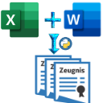
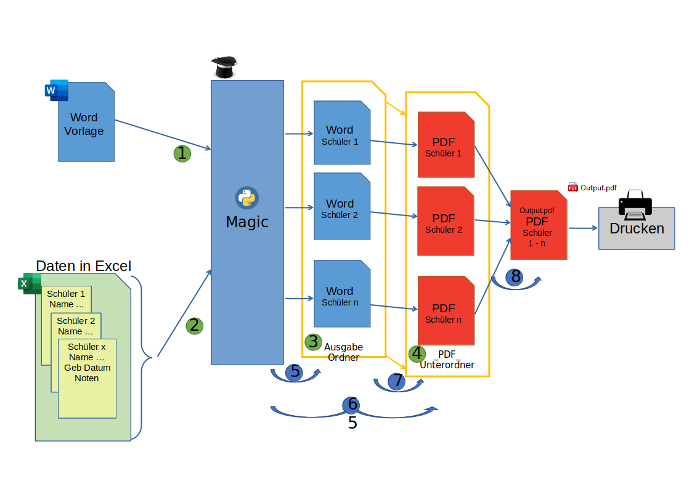
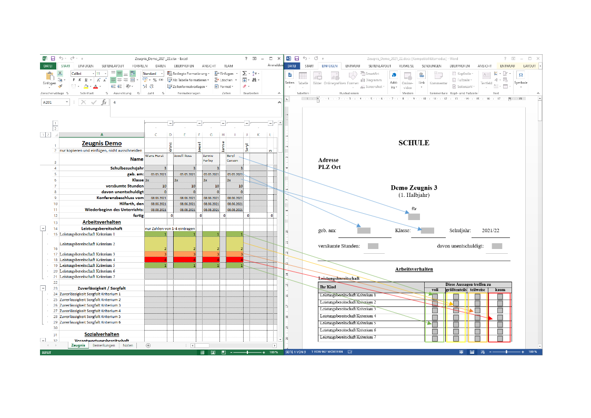
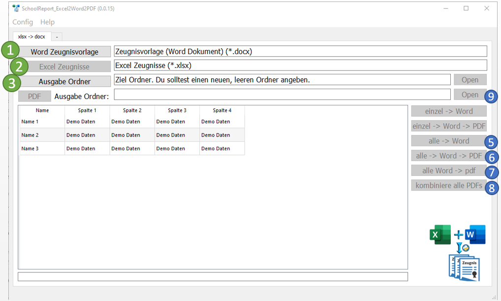
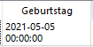
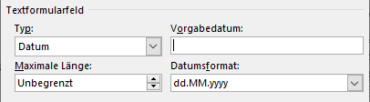

# SchoolReport Excel2Word2PDF

## Übersicht

Schulen müssen mit einem knappen Budget auskommen, hiermit können sie ohne weitere Investition Ihre Zeugnisse komfortabel erstellen. 

Vorlage in Word anlegen, dazu die Daten übersichtlich in Excel vorbereiten/eintragen und in einer art Serienbrief ausgeben.

Das beigelegte Excel Demo kann bis zu 30 Schüler verarbeiten, diese Grenze kann bei Bedarf in Excel erweitert werden.
Alle auszulesenden Excel Daten sind im NamensManager zu finden. und können darüber konfiguriert werden.

Die Demo Word Vorlage ist mit dem Kennwort "demo" geschützt.

## Kompilieren

Um Datenschutzkonform zu bleiben, lässt sich dieses Tool als *.exe exportieren und an die Kollegen weiter verteilen.

Dazu ein venv anlegen und die Pakete der requirement.txt installieren.

Die build.bat aus dem venv heraus gestartet, erzeugt einen dist Ordner, in dem das fertige Porgramm abgelegt wird. 

## Konfigurieren
Damit man nicht immer bis zum Ziel navigieren muss, lässt sich der Dokumentenstartordner ändern.
 - Dazu gehe auf "Config" -> "Wähle Dokumentenstartordner"
 - Zum gewünschten Ordner navigieren und öffnen
 

## Excel und Word Zeugnis Vorlage auswählen
 
1. (1) "Docx Zeugnisvorlage" wählen/öffnen
2. (2) "Excel Zeugnisse" öffnen
   - Danach sind die importierten Daten in der Tabelle zu sehen.
   - Allerdings werden die Daten transponiert dargestellt (In Excel horizontal, hier vertikal)

3. (3) "Ausgabe Ordner" wählen
   - Dieser sollte leer sein
   - Es wird zusätzlich ein Unterordner "\_PDF\_" angelegt
4. Button "PDF" kann vorerst ignoriert werden
5. Nachdem in Schritt 3 der "Ausgabe Ordner" gewählt wurde, aktivieren sich alle nötigen Buttons auf der rechten Seite.

## Zeugnisse erzeugen

### Dokumente für alle Einträge erzeugen

#### Die beste Reihenfolge für den Anfang

<b> - Voraussetzung: Alle nötigen Dokumente und die Ausgabe Ordner wurden ausgewählt.</b>

1. (5) "Alle zu Word"
   - Konvertiert alle Daten aus der Excel-Quelle, für jeden  
   - Das Konvertieren dauert ein bisschen, ist aber immer noch deutlich schneller als zu Fuß.  
2. Kontrollieren, ob die Dokumente OK sind
   - Achtung! Beim Erzeugen der Word Zeugnisse:
     - Word nicht separat öffnen oder darin arbeiten, damit keine Fehler auftreten
3. "alle docx -> PDF"
   - Speichert alle Word Dokumente aus dem "Ausgabe Ordner", neu als PDF im zugehörigen \_PDF\_-Ordner ab 
4. "kombiniere alle PDFs" 
   - im Ordner \_PDF\_ die Datein Output.pdf drucken, diese enthält alle Zeugnisse in einem Dokument.

### Einzelne Dokumente erzeugen  

<b> - Voraussetzung: Alle nötigen Dokumente und die Ausgabe Ordner wurden ausgewählt.</b>

1. Irgendwo in die Zeile des gewünschten Datensatzes klicken
2. "Einzeln zu Word"
   - erzeugt für die selektierte Zeile ein neues *.Docx
3. "Einzel zu Word und PDF" 
   - Erzeugt wie in Schritt 2 das *.Docx und zusätzlich das passende *.PDF
- Einzelne Word Dokumente können nicht in ein *.PDF konvertiert/abgespeichert werden. 
Dieser Schritt muss zur Not manuell erfolgen    

## Hinweise

 - !! Achte darauf, dass das Excel zur Word-Zeugnis-Vorlage passt !!
   - Felder/Tags, die nur in der Word-Zeugnis-Vorlage vorhanden sind, werden auch ausgefüllt
   - Fehlen diese Felder/Tags im Excel-Namensmanager, so kann es zu unerwarteten Programmfehlern kommen.
   - Texte zu den Kompetenzen der Word-Zeugnis-Vorlage werden beibehalten und nicht durch die einträge des Excel-Dokuments überschrieben.
     - Sollten hier Unterschiede auftreten, müssen die beiden Vorlagen aneinander abgeglichen werden

 - Datum mit Uhrzeit in der Vorschau:
   - 
   - Datum mit Uhrzeit in der Vorschau ist kein Grund zur Sorge. 
   - Das Datumsformat wird in der Word-Vorlage definiert, sollte die Zeugnisausgabe falsch sein, muss die Word-Vorlage korrigiert werden.
   - 
   
 - Dieses Projekt funktioniert nur unter Windows & Office (Word & Excel) müssen installiert sein.